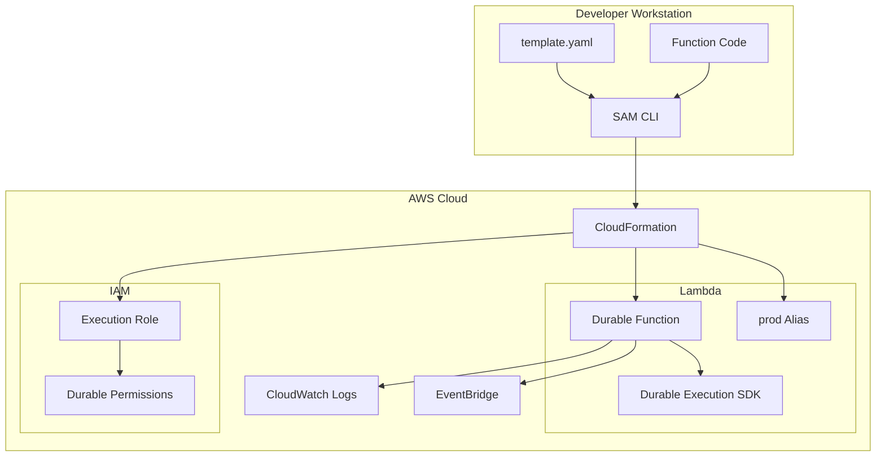

# Design Document

## Overview

This design describes a simple AWS Lambda durable function deployed using AWS SAM. The function demonstrates core durable execution capabilities including step-based checkpointing, automatic retries, and idempotent execution. The implementation uses Node.js with the `@aws/durable-execution-sdk-js` package.

## Architecture



### Deployment Flow

1. Developer writes SAM template and function code
2. `sam build` packages the function with dependencies
3. `sam deploy` creates/updates CloudFormation stack
4. CloudFormation provisions Lambda function, IAM role, and alias

### Execution Flow

1. Function is invoked asynchronously with an execution name
2. Durable execution runtime initializes and tracks state
3. Each `@durable_step` decorated function creates a checkpoint on completion
4. If execution fails, replay resumes from last checkpoint
5. Status changes emit to EventBridge for monitoring

## Components and Interfaces

### SAM Template (template.yaml)

Defines the infrastructure:
- `AWS::Serverless::Function` with DurableConfig
- IAM policies for checkpoint permissions
- AutoPublishAlias for qualified ARN

### Function Handler (src/index.mjs)

Entry point wrapped with `durableExecution()`:
- Receives event and DurableContext
- Orchestrates step execution using `context.step()`
- Returns final result

### Durable Steps

Individual operations wrapped with `durableStep()`:
- Each step is checkpointed on success
- Steps can have custom retry strategies
- Steps receive StepContext for logging

### Project Structure

```
lambda-durable-function/
├── template.yaml          # SAM template
├── samconfig.toml         # SAM deployment config (generated)
└── src/
    ├── index.mjs          # Main handler with steps
    └── package.json       # Node.js dependencies
```

## Data Models

### Event Input

```javascript
{
    message: string,        // Input message to process
    execution_name: string  // Optional: for idempotent invocation
}
```

### Step Result

```javascript
{
    step_name: string,
    status: string,       // "completed" | "failed"
    result: any,          // Step-specific output
    timestamp: string     // ISO 8601 timestamp
}
```

### Final Output

```javascript
{
    execution_id: string,
    steps_completed: string[],
    final_result: any,
    status: string        // "succeeded" | "failed"
}
```


## Correctness Properties

*A property is a characteristic or behavior that should hold true across all valid executions of a system-essentially, a formal statement about what the system should do. Properties serve as the bridge between human-readable specifications and machine-verifiable correctness guarantees.*

Based on the prework analysis, most acceptance criteria relate to AWS infrastructure deployment and SDK/service behavior that we don't control. The testable criteria are structural validations of our template and code.

### Property Reflection

After analyzing the testable criteria:
- 1.2 (DurableConfig validation) and 1.4 (IAM permissions validation) are both template structure checks that can be combined
- 2.1 (SDK decorator usage) is a code structure check

These are example-based tests rather than property-based tests since they verify specific structural requirements in specific files.

### Testable Examples

**Example 1: SAM Template Structure Validation**
The SAM template SHALL contain a DurableConfig section with ExecutionTimeout and RetentionPeriodInDays, and IAM policies with lambda:CheckpointDurableExecutions and lambda:GetDurableExecutionState actions.
**Validates: Requirements 1.2, 1.4**

**Example 2: Handler Uses Durable SDK Functions**
The function handler code SHALL use durableExecution() wrapper on the main handler and durableStep() wrapper on step functions.
**Validates: Requirements 2.1**

Note: This feature is primarily infrastructure setup with behavior provided by AWS services. The correctness of durable execution (checkpointing, idempotency, status events) is guaranteed by the AWS Lambda durable execution runtime, not by our code.

## Error Handling

### Deployment Errors

| Error | Cause | Resolution |
|-------|-------|------------|
| DurableConfig validation failed | Invalid ExecutionTimeout or RetentionPeriodInDays | Check values are within allowed ranges |
| Missing permissions | IAM policy doesn't include checkpoint actions | Add required lambda:* permissions |
| Package build failed | Missing dependencies | Run `npm install` in src/ directory |

### Runtime Errors

| Error | Cause | Resolution |
|-------|-------|------------|
| Step execution failed | Business logic error in step | Check CloudWatch logs, fix code |
| Checkpoint failed | Permissions issue | Verify IAM role has checkpoint permissions |
| Replay inconsistency | Non-deterministic code in handler | Ensure handler code is deterministic |

### Best Practices

1. Keep step functions deterministic - avoid random values or timestamps outside steps
2. Use meaningful step names for debugging
3. Configure appropriate retry strategies for transient failures
4. Set reasonable ExecutionTimeout based on expected workflow duration

## Testing Strategy

### Unit Testing

Since this is primarily an infrastructure setup feature, unit testing focuses on:

1. **Template Validation**: Verify SAM template has correct structure
   - DurableConfig section exists with required fields
   - IAM policies include checkpoint permissions
   - AutoPublishAlias is configured

2. **Code Structure Validation**: Verify handler uses SDK correctly
   - Main handler has @durable_execution decorator
   - Step functions have @durable_step decorator

### Integration Testing (Manual)

After deployment, manually verify:

1. Function appears in Lambda console with durable execution enabled
2. Invoke function and observe execution in Durable Executions tab
3. Verify steps checkpoint correctly
4. Test idempotency by invoking with same execution name

### Testing Framework

- **Unit Tests**: Jest or Vitest
- **Template Validation**: js-yaml for parsing template.yaml

Note: Property-based testing is not applicable for this feature since:
- Most requirements are infrastructure deployment (AWS service behavior)
- Testable criteria are structural validations of specific files
- No business logic with variable inputs that would benefit from property-based testing
